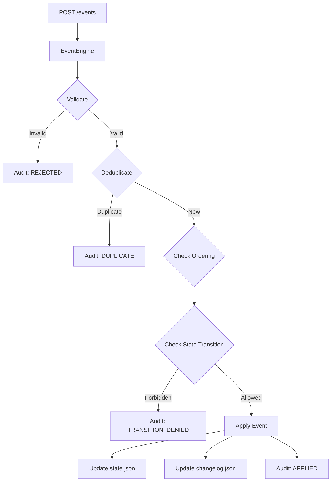
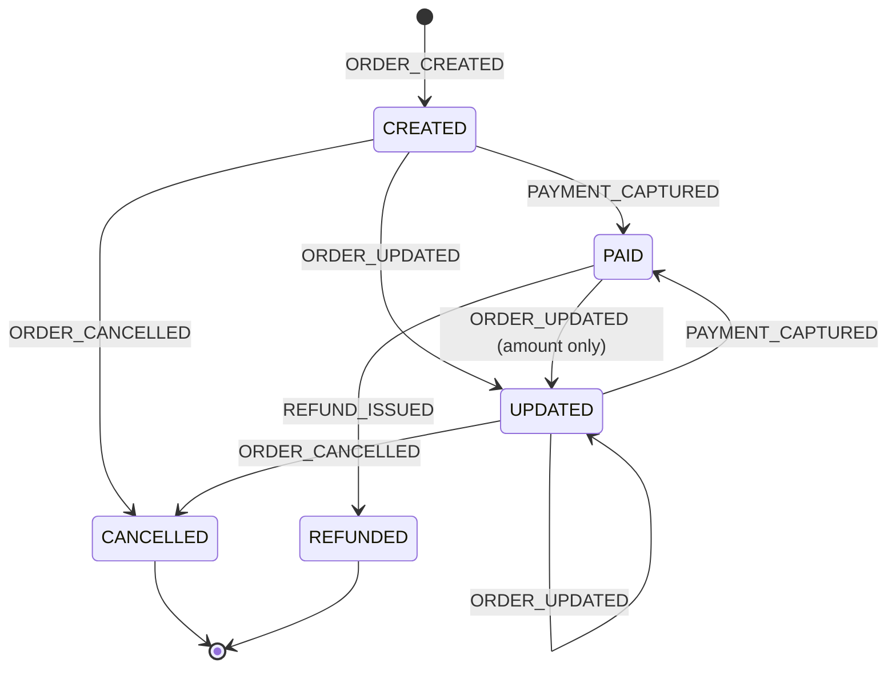

## Orders handling engine

**installing**
`yarn install`

**running**
`yarn dev`

**tests:**
`yarn test`

**3 endpoints**
- **`POST /events`** – accepts a batch of events, processes each through the pipeline, and returns per-event decisions
- **`GET /orders/:id`** – order status + change history + rejected events + duplicates
- **`GET /stats`** – statistics (applied / rejected / duplicates / avg processing time)

##### **Possible improvements**
- currently the app uses `readFileSync`, using `readFile` can increase the performance but would need an additional order locking mechanism. Also other solutions could be applied for handling a huge traffic.
- splitting code and writing more unit tests in eventEngine.ts

##### Potential security improvements
###### 1. HTTP Infrastructure & Transport
- **Security Headers (Helmet):** Use the `helmet` middleware to set various HTTP headers that help protect against cross-site scripting (XSS), clickjacking, and other common attacks.
- **SSL/TLS Enforcement:** Ensure the application is only accessible via HTTPS. In a production environment, this can be handled by a reverse proxy (like Nginx) or a load balancer.
- **CORS Configuration:** If the API is accessed from a browser-based frontend, use the `cors` package to restrict origins that can interact with the API, rather than leaving it open with defaults.

###### 2. Authentication & Authorization
- **API Authentication:** Currently, the routes are open. Implementing an authentication mechanism (e.g., API Keys, JWT, or OAuth2) would ensure that only authorized services can submit events or query order status.
- **Role-Based Access Control (RBAC):** Restrict access to sensitive endpoints. For example, `POST /events` might require "write" permissions, while `GET /stats` might be restricted to "admin" or monitor roles.

###### 3. Input Validation & Body Limits
- **Schema Validation:** Use a library like **Zod** or **Joi** to strictly validate the structure of the incoming event batches. This prevents processing malformed data that could lead to crashes or unstable states.
- **Payload Size Limits:** Explicitly set limits in `express.json({ limit: '100kb' })` to prevent attackers from sending massive JSON payloads that could exhaust memory.
- **Batch Size Limits:** Limit the number of events allowed in a single `POST /events` request to prevent long-running processing cycles that block the event loop.

###### 4. Availability & Rate Limiting
- **Rate Limiting:** Implement `express-rate-limit` to prevent brute-force attacks or unintentional flooding of any endpoint.
- **DoS Protection on Query Routes:** The `GET /stats` and `GET /orders/:id` routes currently load and iterate through potentially large JSON files. Implementing pagination or caching for statistics would prevent resource exhaustion as the data grows.

###### 5. Storage Security & Data Integrity
- **Encryption at Rest:** Since OrderState contains sensitive fields like `shippingAddress` and `customerNote`, the JSON files should be encrypted at rest, or these fields should be masked/encrypted at the application level before being saved.
- **Atomic Operations:** The current "Read-Modify-Write" pattern in src/engine/store.ts is susceptible to race conditions. Moving to a database with transaction support (like PostgreSQL or MongoDB) or implementing a file-locking mechanism would prevent data corruption during concurrent requests.
- **Audit Log immutability:** Ensure the audit log can only be appended to and not modified or deleted by the application logic, providing a reliable trail for forensic analysis.

###### 6. Observability
- **Secure Logging:** Ensure that logs do not leak PII (Personal Identifiable Information) from the event payloads.
- **Anomaly Detection:** Monitor for high rejection rates or unusual spikes in event volume, which could indicate a malfunctioning client or a malicious attempt to corrupt the state machine.

### Documentation
##### **engine graph**

##### **state machine**

##### Allowed transitions map:
| From \ To    | CREATED | UPDATED | PAID | CANCELLED | REFUNDED |
|-------------|---------|---------|------|-----------|----------|
| (none)      | ✅       |         |      |           |          |
| CREATED     |         | ✅       | ✅    | ✅         |          |
| UPDATED     |         | ✅       | ✅    | ✅         |          |
| PAID        |         | ✅*      |      |           | ✅        |
| CANCELLED   |         |         |      |           |          |
| REFUNDED    |         |         |      |           |          |

*PAID → UPDATED: only partial fields (e.g. shipping address), status stays PAID.

###### Out-of-order Event Strategy
When an event arrives with an older timestamp than the last accepted event:
1. **If the order is in a terminal state (CANCELLED, REFUNDED)** → reject the late event.
2. **If the late event carries partial payload data** → merge non-conflicting fields (e.g. a late event setting `shippingAddress` when current state doesn't have it).
3. **If the late event conflicts with current state** (e.g. different `amount`) → reject and log to audit as `LATE_REJECTED`.
4. **If the late event is ORDER_CREATED but order already exists** → ignore (duplicate creation).

